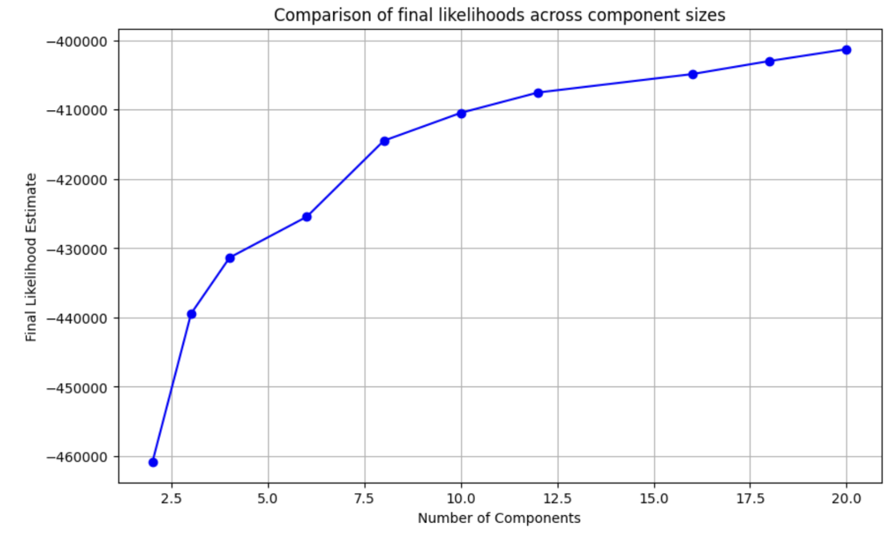
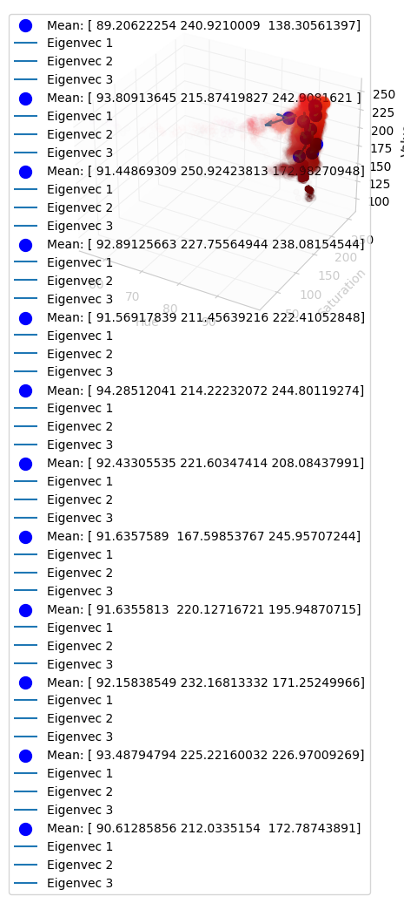
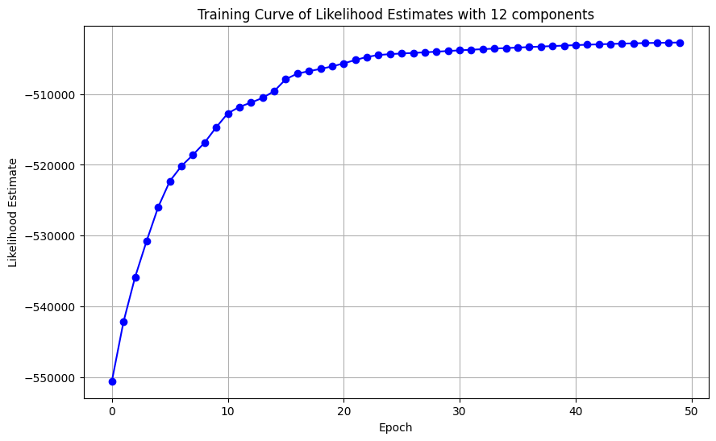
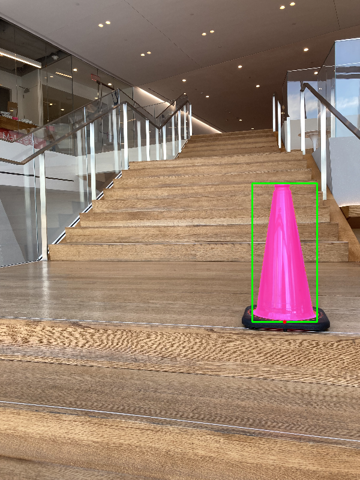
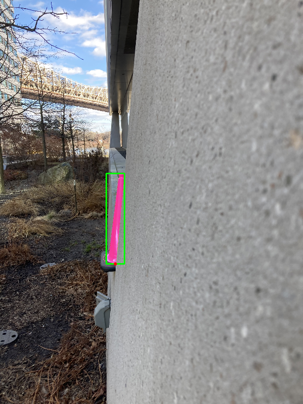
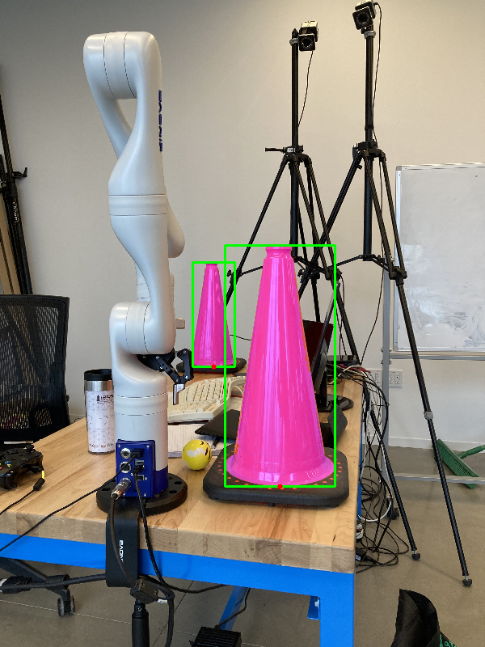

# Orange Cone Detection with a Gaussian Mixture Model
Development of Gaussian Mixture Model from scratch with Numpy, trained using EM algorithm to efficiently detect orange cones in images

## Instructions for running test script
The best performing model (specifically, its lookup table for prediction) is stored in `lookup_table_12_components.npy` and the results are output to `test_12_components_GMM_output.txt`.  

To run the test script for inference, cd to `Project1_submission` and then run `python test_script.py`.  
- HOWEVER, BEFORE RUNNING the script, please set the `folder` variable on line 14 in test_script.py equal to the path to the directory of test images.  
- I have included cv2 images that are shown as the script is run to demonstrate the processing steps. Just press any key (space bar for example) to continue the script  
- the final bounding box images are placed in the `Output_images` directory after running `test_script.py`  
- I have saved THREE models/learning algorithms for testing:  
&nbsp; - The first one uses the built-in Gaussian Mixture model code from sklearn.mixture. I have it to verify the correctness and efficiency of the rest of my project pipeline (e.g. hand-labeling, shape-statistics, test speed, etc.). When running test_script.py, the outputs of this model will be written to `test_builtinGMM_output.txt`. *NOTE: Running this model will likely no longer work, and therefore has been commented out*  
&nbsp; - The second model is my own naive implementation of the Gaussian Mixture Model that uses 1 gaussian component for the orange cone class. When running test_script.py, the outputs of this model will be written to `test_naive_implementation_output.txt`. *NOTE: Running this model will likely no longer work, and therefore has been commented out*  
&nbsp; - The THIRD AND FINAL model is my best performing model. When running test_script.py, the outputs of this model will be written to `test_12_components_GMM_output.txt`.

 

## Introduction
For this project, I built a data pipeline that trained and deployed a Gaussian Mixture Model and could detect the existence, location, and distance of orange cones in images based off a set of unlabeled training images. Building this end-to-end pipeline from scratch took significant time and required utilizing coding, mathematical, debugging, data processing, and general problem-solving skills to accomplish.  
While there were a diverse variety of issues to tackle in this project some of the defining issues were: 
1. **Dealing with unserpvised data** - this not only limited the types of machine learning models we could use (see: generative models), but also required writing code to effectively pre-process and hand-label parts of the training images.
2. **Building a GMM training model with just Numpy**, that could not only accurately train the model but also do so in a fast and efficient way, due to the large amount of training data (i.e., pixels in an image).
3. **Building prediction software** that could quickly predict cones in testing data as well as their distance, while filtering out any noise picked up in the test images. 

My implementation and optimizations aim to effectively address these challenges, among others.

### Hand Labeling
My hand-labeling/pre-processing code is in `Hand_labeling.py`. I used Opencv to read the images in and Roipoly to compute the hand-labeling orange cone pixels and manually create a mask, using the [example script in their github](https://github.com/jdoepfert/roipoly.py/blob/master/examples/basic_example.py) as a basis.

One optimization I used was to save the HSV space as my training data rather than RGB data - my hypothesis was that it would 1) handle differences in lighting better in images and 2) better separate the orange cone pixels from the red chair and orange podium pixels.

### GMM Learning algorithm

I did 3 implementations:
1. My own GMM learning implementation using the EM algorithm, located in `GMM_Partition_space.ipynb`
2. A naive implementation where I constricted the number of components to 1, constraining my implementation to be a naive bayes algorithm. This is coded in `naive_GMM.ipynb`, and provided me with an initial baseline.
3. A version using the built-in version in Scikit-learn and the built-in multivariate normal pdf function, coded in `builtin_GMM.ipynb`. I built this as a reference for end-to-end testing on the rest of my pipeline.

Training efficiency optimizations:
- I use high-dimensional numpy broadcasting to increase the training speed and therefore quickly test out different hyperparameters/components. For example, training GMM models with component sizes of  [2, 3, 4, 6, 8, 10, 12, 16, 18, 20] for 30 epochs each took *28.7 seconds* in total (likely much less without print statements and visualizations).

For choosing the number of components, I used a couple methods and heuristics:
- I graphed the likelihood on the last epoch for GMM models of different component sizes, to see where marginal improvements in log-likelihood began to drop off. I found that improvements typically began to flatten around 10-12 components:

- I also did a heuristic eye-test by visualizing the learned gaussians over the data. Here, I looked for components that appeared to visually explain the data well. I tried to find the model with the smallest component size that consistently had a component accounting for the white-ish pixels on a cone. The model with 12 components seemed to do consistently well here:

### Prediction and Image Segmentation
I first coded and experimented/tested my image segmentation/classification in `segment_images.ipynb`, and then my final implementation for the test script is in `inference.py`.

For hand-labeling, training, and prediction, I only looked at one class, specifically “orange cone” pixels. Therefore, while others may have used bayes rule to pick the best class for a pixel, I just computed the likelihood for a pixel to be in the orange class based on my trained model, and selected the pixels over a manually-determined threshold. This saved me a lot of time, and also meant I didn’t have to make any assumptions on priors for the probabilities of other classes like “red chair.”

First, to make prediction/classification of test images fast and efficient, I pre-computed and populated *lookup tables* for each trained model (3D numpy array) before testing time, storing a likelihood value in each bin. The lookup table code can be found in `GMM_Partition_space.ipynb`.

I segmented the images and grouped the segmented regions using tools from *skimage*. I first created a mask over the test images to show regions initially classified as “orange cone.” Then, I filtered out regions with less than 100 pixels, and then performed dilation followed by erosion to eliminate the noise in the image and to fill in holes in the cones. Finally I created bounding boxes with the remaining pixel clusters.

For estimating the distance, I used the equation for pinhole camera image projection:
*(image height / image distance) = (cone height / cone distance)*

### Results

I used a GMM model with 12 components for my final predictions.

Training curve for training a GMM model with 12 components (y-axis meant to be labeled log-likelihood):

Some of the test results:

